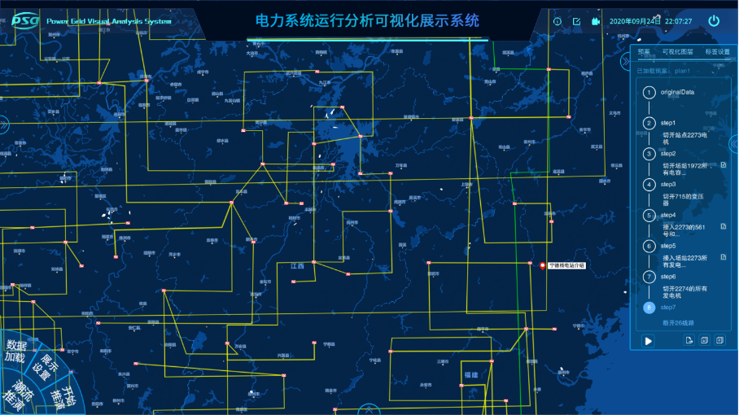
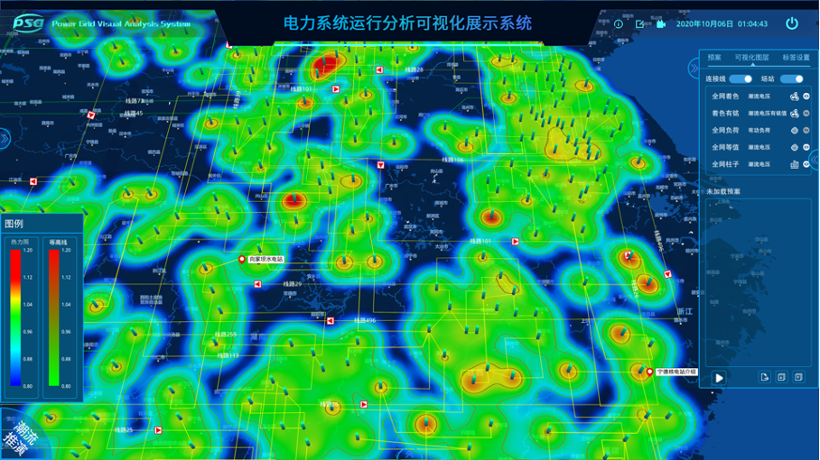

The smart grid is clearly making the power system more intelligent, with much more sensing and embedded automatic control. Therefore, a large scale power system is usually consisted of ten thousands of buses and each bus has 5+ variates. The large scale power system makes the grid even more complex and creating the need for continually improved tools to help humans design and operate the smart grid of tomorrow. 

Wide-area power system visualization is crucial in order for operators to respond effectively during disturbances and for planners to have a better understanding of the systems they are designing. We developed a visual analytics system with 10+ visualization techniques, including pie charts, animation, contouring, time-varying graphs, multi-layer geographic-based displays, image blending, and trends arrows. 

The product has been deployed in many power grid departments. Specifically, by leveraging clustering algorithms, a department has utilized the visual analytics system to figure out root cause of failures. Some departments implemented an interactive planning tool based on the system.

Role
======
Project management, product design and technique support

Team
======
6 members

