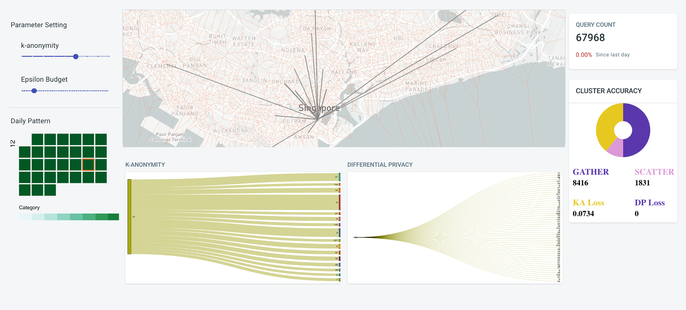

Rare behaviors indicate important events and situations in maritime surveillance applications. State-of-the-art methods provide many effective solutions to detect anomalous behaviors. Meanwhile, most anomalous behaviors should be identified by experts with human knowledge in a visual analytics manner. This project is concerned with a scheme across trajectories, vessel attributes and the movement context for detecting anomalous behaviors through kNN-based clustering, and verification. More importantly, the detecting procedure can be completed on-the-fly and response instantly. Experts are able to know vessel behaviors of their interest and look into details to figure out the possible reasons by changing only a single parameter. The proposed scheme is evaluated via a simulated data set for performance and a real life AIS data for effectiveness.

Technical Stack
======
C++, CUDA, python, ReactJS, Mapbox, websocket

Team
======
2 members work closely with DSTA

